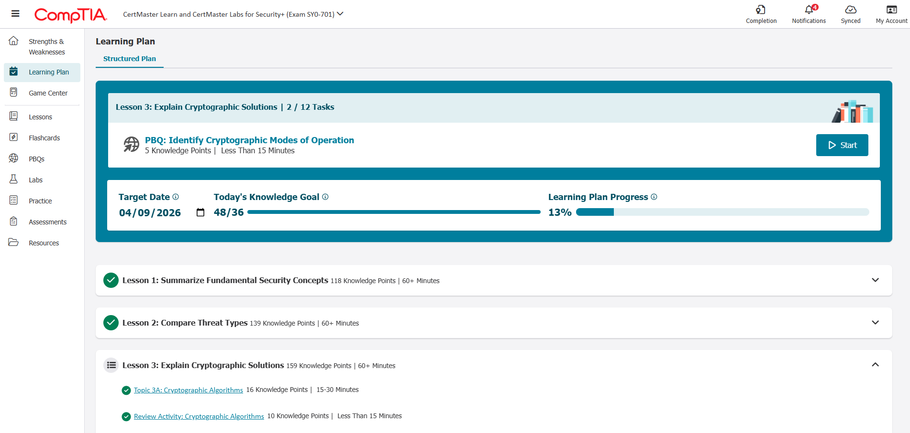

# CompTIA Security+

Currently studying CompTIA Security+ (SY0-701) to strengthen cybersecurity fundamentals and SOC-related knowledge.

## Topics Studied

- Network Security
- Threats and Vulnerabilities
- Security Operations
- Identity and Access Management
- Risk Management

## Learning Progress

